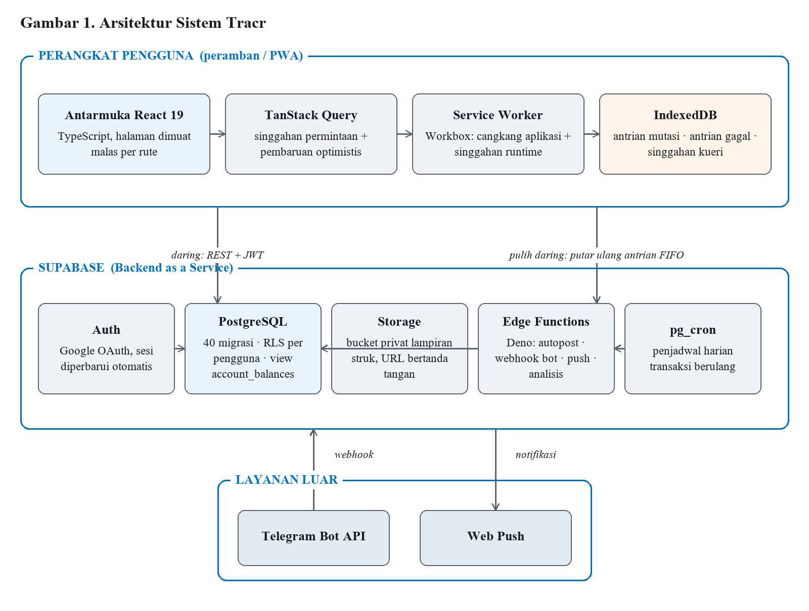
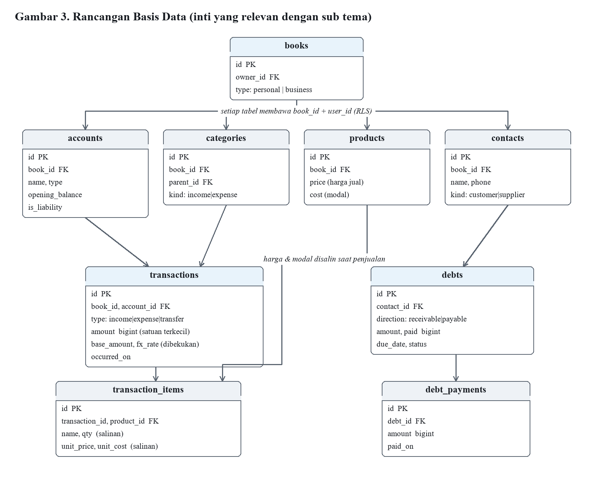
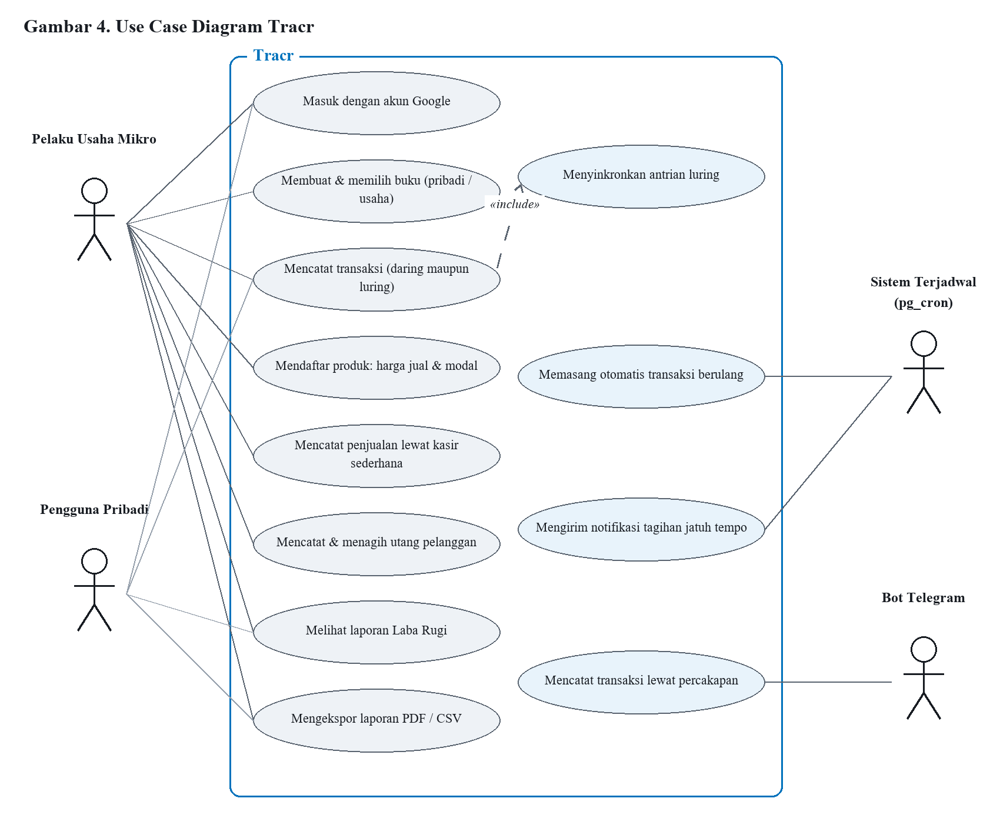
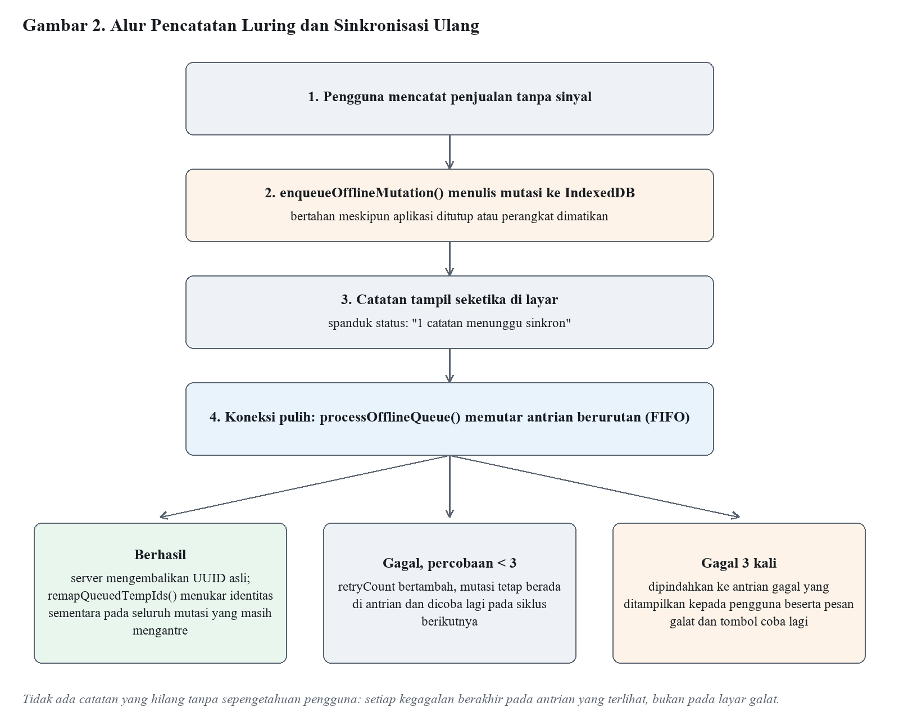

# Proposal Veternity Beraksi 2026 — sumber teks

> **Cara pakai.** Berkas ini adalah salinan teks final yang sudah masuk ke `VB2026_WebDev_IDUBmandus.docx`
> (15 halaman: 1 sampul + **13 halaman isi** + 1 lampiran — tepat batas panitia).
> Teks yang benar-benar dipakai untuk membangun `.docx` ada di [`build_proposal.py`](build_proposal.py).
> Kalau mengubah kalimat di sini, ubah juga di skrip itu lalu jalankan ulang:
>
> ```bash
> python docs/veternity/build_diagrams.py && python docs/veternity/build_proposal.py
> ```
>
> Menambah teks akan menambah halaman — cek ulang jumlah halaman sebelum kirim.

---

## Halaman Sampul

PROPOSAL KARYA — Diajukan untuk Babak Penyisihan
Web Development Competition — Veternity Beraksi 2026

Tema: *Bridging the Gap: Digital Platforms for Equitable Economic Access*
Sub Tema: Micro-Capital Crowdfunding & Financial Management

**TRACR**
Buku Kas Digital yang Tetap Berjalan Saat Sinyal Mati: Platform Manajemen Keuangan Mikro Berbasis *Offline-First* untuk Pelaku Usaha Mikro dan Masyarakat *Unbanked*

| | |
|---|---|
| Nama Tim | IDUB mandus |
| Anggota 1 | Muhammad Choirudin Ammar — 25/556251/TK/62735 |
| Anggota 2 | Muhammad Raihan Surya — 25/560713/TK/63338 |
| Anggota 3 | Ahmad Rafi Firdaus — 25/560526/TK/63314 |
| Perguruan Tinggi | Universitas Gadjah Mada |
| Program Studi | Teknologi Informasi, Fakultas Teknik |
| Tautan Website | https://tracr-ai.vercel.app |
| Repositori GitHub | https://github.com/astrorehan/FinancialTracker |

2026

---

## 1. Judul Karya & Nama Tim

**Judul Karya:** Tracr — Buku Kas Digital yang Tetap Berjalan Saat Sinyal Mati: Platform Manajemen Keuangan Mikro Berbasis *Offline-First* untuk Pelaku Usaha Mikro dan Masyarakat *Unbanked*.

**Nama Tim:** IDUB mandus — Universitas Gadjah Mada.

**Sub Tema:** Sub Tema 2 — Micro-Capital Crowdfunding & Financial Management.

Tracr adalah aplikasi web pencatatan keuangan mikro yang berfungsi penuh tanpa koneksi internet, menggunakan bahasa sehari-hari alih-alih istilah akuntansi, dan dapat dipasang ke layar utama telepon genggam tanpa melalui toko aplikasi. Satu antarmuka melayani dua kebutuhan sekaligus: pencatatan keuangan pribadi dan pembukuan usaha mikro (Buku Usaha), yang dipisahkan secara tegas melalui mekanisme multi-book.

---

## 2. Latar Belakang Masalah

### 2.1 Kesenjangan Ekonomi yang Disasar

UMKM merupakan tulang punggung perekonomian Indonesia: sekitar 64 juta unit, menyumbang sekitar 61% Produk Domestik Bruto dan menyerap sekitar 97% tenaga kerja `[verifikasi: Kemenkop UKM]`. Namun lebih dari 90% di antaranya berskala mikro — warung kelontong, pedagang kaki lima, penjual makanan rumahan, penjahit — dan menjalankan usaha tanpa pencatatan keuangan formal dalam bentuk apa pun `[verifikasi: sumber proporsi usaha mikro]`. Pada saat yang sama, sebagian besar penduduk dewasa masih tergolong *unbanked* atau *underbanked* `[verifikasi: SNLIK OJK]` sehingga hampir seluruh transaksinya berjalan tunai. Akibatnya, solusi keuangan digital yang mengandalkan sinkronisasi rekening bank — *open banking*, agregasi mutasi, kategorisasi otomatis dari pesan bank — tidak dapat menjangkau mereka sama sekali, karena data sumbernya memang tidak pernah ada.

Kesenjangan itu diperparah sebaran kualitas jaringan yang tidak merata; sejumlah wilayah pedesaan masih berstatus *blank spot* `[verifikasi: APJII]`. Bagi pedagang pasar yang sedang melayani pembeli, aplikasi yang menampilkan layar kosong belasan detik karena menunggu peladen bukan sekadar tidak nyaman — aplikasi itu tidak dapat dipakai.

### 2.2 Empat Lapis Hambatan

| Hambatan | Wujud nyata di lapangan | Konsekuensi ekonomi |
|---|---|---|
| Geografis | Sinyal putus-putus atau hilang di pasar, pelosok desa, dan area produksi | Pencatatan tertunda lalu terlupakan; data keuangan usaha tidak pernah lengkap |
| Literasi | Istilah "aset", "liabilitas", "rekonsiliasi", "jurnal" pada aplikasi yang ada | Pengguna awam merasa aplikasi bukan untuk dirinya dan berhenti di langkah pertama |
| Perangkat & kuota | Telepon kelas pemula, memori hampir penuh, kuota terbatas | Enggan memasang aplikasi puluhan megabita dari toko aplikasi |
| Akses permodalan | Tidak ada rekam jejak keuangan tertulis saat mengajukan KUR atau pinjaman koperasi | Pengajuan modal ditolak; usaha tidak naik kelas meskipun sehat secara arus kas |

Hambatan keempat adalah simpul persoalan yang sesungguhnya, dan menjadi alasan karya ini relevan dengan *equitable economic access* — bukan sekadar *financial management*. Pelaku usaha mikro dapat memiliki arus kas sehat bertahun-tahun namun tetap ditolak saat mengajukan modal, semata-mata karena tidak memiliki dokumen yang membuktikannya. Bagi lembaga keuangan, usaha tanpa catatan adalah usaha yang tidak terlihat.

### 2.3 Mengapa Solusi yang Ada Belum Menjawab

Aplikasi pembukuan yang beredar mengandaikan tiga hal yang justru tidak dimiliki kelompok sasaran: koneksi stabil, keakraban dengan istilah akuntansi, dan kesediaan memasang aplikasi berukuran besar. Sebagian juga mengunci laporan laba rugi dan ekspor data di balik langganan berbayar, tepat ketika data itu mulai berguna. Yang paling menentukan, banyak aplikasi memperlakukan dukungan luring hanya sebagai penyimpanan sementara untuk membaca data; ketika pengguna mencoba menulis, operasi tersebut gagal atau menggantung. Padahal justru menulis itulah inti sebuah buku kas.

### 2.4 Rumusan Masalah

1. Bagaimana merancang platform manajemen keuangan mikro yang tetap menerima pencatatan baru tanpa koneksi internet, dan menyinkronkannya secara utuh serta berurutan ketika koneksi pulih?
2. Bagaimana menyajikan konsep modal, laba, piutang, dan utang kepada pengguna tanpa latar belakang akuntansi, tanpa mengorbankan ketepatan perhitungan?
3. Bagaimana mengubah kebiasaan mencatat harian menjadi rekam jejak keuangan yang dapat dipertanggungjawabkan sebagai dokumen pendukung akses permodalan formal?

---

## 3. Solusi, Tujuan, dan Manfaat Aplikasi

### 3.1 Gagasan Solusi

Tracr menjawab ketiga rumusan masalah melalui tiga pilar rancangan yang seluruhnya sudah terimplementasi dan berjalan pada website yang dinilai.

#### Pilar 1 — *Offline-First* yang Sesungguhnya

Tracr tidak sekadar menyimpan salinan data untuk dibaca. Setiap operasi penulisan yang dilakukan saat perangkat luring masuk ke antrian mutasi di IndexedDB peramban, dengan cadangan `localStorage`. Ketika koneksi pulih, pekerja antrian memutar ulang mutasi satu per satu sesuai urutan masuk (FIFO) ke basis data. Rancangan ini menangani tiga persoalan yang biasanya diabaikan implementasi luring sederhana:

1. **Ketergantungan antarmutasi.** Bila pengguna membuat produk baru saat luring lalu langsung menjualnya, mutasi penjualan merujuk identitas sementara yang belum ada di peladen. Fungsi `remapQueuedTempIds` menukar seluruh kemunculan identitas itu dengan UUID asli begitu mutasi induknya tersimpan, sehingga rantai mutasi tidak putus.
2. **Kegagalan yang tidak menghilang diam-diam.** Mutasi gagal diulang paling banyak tiga kali, lalu dipindahkan ke antrian gagal yang ditampilkan kepada pengguna beserta pesan galat dan tombol coba lagi. Data pengguna tidak pernah hilang tanpa pemberitahuan.
3. **Kejelasan status.** Spanduk status menampilkan kondisi luring dan jumlah catatan yang menunggu sinkronisasi, sehingga pengguna tahu catatannya aman meskipun belum terkirim.

Lebih dari 40 jenis operasi didukung secara luring: transaksi, akun, kategori, anggaran, target tabungan, utang-piutang, produk, dan cicilan.

#### Pilar 2 — Bahasa Manusia, Bukan Bahasa Akuntansi

Antarmuka berbahasa Indonesia secara bawaan dan sengaja menghindari istilah akuntansi. Pengguna tidak pernah bertemu kata "liabilitas"; yang muncul adalah jenis akun "Kartu Kredit" atau "Pinjaman" yang menjelaskan dirinya sebagai uang yang harus dibayar. Pada modul utang-piutang pilihannya "Pelanggan ngutang" dan "Saya ngutang"; pada modul usaha kolomnya bernama "Modal" dan hasilnya "Untung". Aksesibilitas juga ditangani secara teknis: pengaturan ukuran teks, mode gelap, kontras yang dijaga, navigasi bawah pada tampilan telepon, serta status kosong yang selalu menawarkan satu tindakan berikutnya.

#### Pilar 3 — Dua Buku dalam Satu Aplikasi

Nasihat pertama setiap pendamping UMKM adalah memisahkan uang pribadi dari uang usaha. Tracr menjadikannya satu ketukan: setiap catatan dipartisi berdasarkan `book_id`, dan setiap buku berjenis `personal` atau `business`. Saat pengguna berpindah ke buku usaha, aplikasi membuka tiga alat yang tidak relevan bagi pengguna pribadi — Produk & Kasir Sederhana, Utang-Piutang, dan Laba Rugi.

#### Jembatan Menuju Akses Permodalan

Ketiga pilar bermuara pada satu keluaran yang menjawab hambatan keempat pada Bagian 2.2. Setelah beberapa bulan mencatat, pengguna dapat menghasilkan Laporan Laba Rugi dan riwayat transaksi lengkap dalam bentuk PDF maupun CSV — dokumen yang selama ini tidak dimiliki pelaku usaha mikro saat berhadapan dengan bank, koperasi, atau program pendanaan. Tracr karena itu bukan sekadar alat catat-mencatat, melainkan mesin pembentuk rekam jejak keuangan yang mengubah usaha yang tidak terlihat menjadi usaha yang dapat dinilai.

### 3.2 Tujuan

1. Membangun platform manajemen keuangan mikro yang berfungsi penuh — termasuk operasi penulisan — tanpa koneksi internet, dan menyinkronkan data secara berurutan serta dapat diaudit ketika koneksi pulih.
2. Menyediakan antarmuka berbahasa Indonesia bebas istilah akuntansi sehingga dapat dipakai pelaku usaha mikro tanpa pelatihan formal.
3. Memisahkan pembukuan usaha dari keuangan pribadi melalui mekanisme multi-book tanpa mengharuskan pengguna membuat akun kedua.
4. Menghasilkan laporan laba rugi dan riwayat transaksi yang dapat diekspor sebagai dokumen pendukung pengajuan permodalan, serta menjaga seluruh fitur inti tetap gratis di atas arsitektur yang biayanya tidak bertambah linier terhadap jumlah pengguna.

### 3.3 Manfaat

**Bagi pelaku usaha mikro:** mengetahui laba yang sebenarnya, bukan sekadar jumlah uang di laci; mengetahui siapa berutang dan sudah berapa lama; memiliki dokumen keuangan saat mengajukan modal; memisahkan uang usaha dari uang belanja rumah tangga.

**Bagi pekerja informal dan masyarakat *unbanked*:** memperoleh alat pencatatan yang tidak mensyaratkan rekening bank, koneksi tetap, maupun telepon genggam kelas atas.

**Bagi ekosistem keuangan:** bertambahnya pelaku usaha mikro yang memiliki rekam jejak tertulis memperbesar populasi calon penerima kredit yang dapat dinilai, sehingga menurunkan hambatan penyaluran pembiayaan mikro.

---

## 4. Ruang Lingkup & Batasan Aplikasi

### 4.1 Ruang Lingkup

| Aspek | Keterangan |
|---|---|
| Platform & pengguna | Aplikasi web berbasis peramban yang dapat dipasang sebagai Progressive Web App ke layar utama telepon genggam, untuk pelaku usaha mikro, pekerja informal, dan individu yang mengelola keuangan secara tunai |
| Cakupan fungsional | **Pribadi:** multi-akun, multi-mata uang, transaksi pemasukan/pengeluaran/transfer, kategori bertingkat, label, anggaran, tagihan berulang, target tabungan, cicilan, laporan. **Usaha:** produk & kasir sederhana, utang-piutang per pelanggan, laporan laba rugi, kontak pelanggan/pemasok |
| Bahasa & mata uang | Bahasa Indonesia (bawaan) dan Inggris; multi-mata uang dengan kurs yang dikelola pengguna dan dibekukan per transaksi |
| Mode operasi | Daring dan luring penuh (baca dan tulis); kanal tambahan berupa bot Telegram |

### 4.2 Batasan

| Batasan | Alasan rancangan |
|---|---|
| Bukan dompet elektronik; tidak menyimpan uang dan tidak memproses pembayaran | Aplikasi murni pencatatan sehingga tidak menimbulkan risiko dana pengguna; pemrosesan pembayaran juga memerlukan perizinan yang tidak dimiliki tim |
| Tidak terhubung ke rekening bank (tanpa *open banking*); kurs dimasukkan manual | Kelompok sasaran justru bertransaksi tunai, sehingga ketergantungan pada rekening akan menggugurkan relevansi solusi; kurs manual menjaga aplikasi tetap gratis (kolom `source` sudah disiapkan untuk pengisian otomatis kelak) |
| Satu pengguna per buku (belum multi-kasir) | Model keamanan bertumpu pada RLS `auth.uid() = user_id`; berbagi buku memerlukan model izin baru yang belum diuji cukup |
| Manajemen stok belum tersedia | Ditunda karena berisiko menimbulkan galat perhitungan pada demo langsung; produk menyimpan harga dan modal, belum jumlah persediaan |
| Pengingat utang dikirim manual lewat tautan WhatsApp | Pengiriman otomatis memerlukan verifikasi akun bisnis Meta yang masih dalam proses |

### 4.3 Asumsi

1. Pengguna memiliki telepon genggam dengan peramban modern yang mendukung Service Worker dan IndexedDB.
2. Pengguna memiliki akses internet sesekali — tidak harus terus-menerus — untuk masuk pertama kali dan menyinkronkan data.
3. Pengguna memiliki akun Google untuk masuk; opsi masuk tanpa Google merupakan pengembangan lanjutan yang sudah direncanakan.

---

## 5. Teknologi yang Digunakan

### 5.1 Ringkasan Tumpukan Teknologi

| Lapisan | Teknologi | Alasan pemilihan |
|---|---|---|
| Frontend | React 19 + TypeScript 6 + Vite 8 + Tailwind CSS v4 | Pemeriksaan tipe menyeluruh, waktu bangun cepat, keluaran statis murni, satu sumber token warna |
| Data, rute, grafik | TanStack Query v5, React Router 7, Recharts 3, React Hook Form 7 + Zod 4 | Singgahan permintaan dan pembaruan optimistis (titik sisip alami bagi antrian luring); rute dimuat malas; validasi berskema sebelum data dikirim |
| PWA & luring | vite-plugin-pwa + Workbox; IndexedDB + localStorage | Service Worker, manifes, pemasangan ke layar utama; antrian mutasi, antrian gagal, dan singgahan kueri yang bertahan setelah aplikasi ditutup |
| Basis data & autentikasi | Supabase PostgreSQL (40 migrasi), Auth Google OAuth, Storage bucket privat | Relasional dengan view, trigger, dan Row Level Security per pengguna; tanpa pengelolaan kata sandi sendiri; lampiran dilindungi URL bertanda tangan |
| Sisi peladen | Supabase Edge Functions (Deno) + pg_cron | Tujuh fungsi terisolasi; kunci rahasia tidak pernah menyentuh peramban; penjadwal transaksi berulang |
| Pengujian & penggelaran | Vitest (187 kasus uji, 17 berkas); Vercel + Supabase | Uji memusat pada logika perhitungan uang; keduanya berjalan pada paket gratis, aset diberi cache permanen sedangkan Service Worker tidak di-cache |

### 5.2 Fungsi Sisi Peladen dan Ketepatan Perhitungan Uang

Tujuh Edge Function menangani seluruh pekerjaan yang tidak boleh berjalan di peramban. `recurring-autopost` dipanggil pg_cron setiap hari untuk memasang transaksi berulang yang jatuh tempo, menyusul periode terlewat, lalu memajukan tanggal jatuh tempo. `tg-webhook` dan `wa-webhook` mengubah pesan bot menjadi transaksi pada buku yang tertaut dan berbagi inti pemrosesan. `send-push` mengirim notifikasi pengingat tagihan, `ai-analysis` menyediakan ringkasan pengeluaran opsional (Bagian 6.4), sedangkan `billing-checkout` dan `midtrans-webhook` merupakan jalur pembayaran opsional yang tidak diaktifkan pada versi lomba.

Seluruh nilai uang disimpan sebagai bilangan bulat satuan terkecil (`bigint`) — rupiah tanpa desimal, sen untuk mata uang dua desimal, satoshi untuk aset kripto. Tidak ada nilai uang yang pernah disimpan sebagai bilangan pecahan; konversi hanya terjadi di tepi sistem melalui `src/lib/money.ts`, sehingga galat pembulatan pecahan biner yang lazim pada aplikasi keuangan berbasis JavaScript tidak dapat muncul. Saldo akun pun tidak dihitung di sisi klien: view SQL `account_balances` menjumlahkan saldo awal ditambah seluruh mutasi bertanda, termasuk transfer yang mendebit akun asal dan mengkredit akun tujuan, dan klien hanya membaca hasilnya.

---

## 6. Fitur Utama & Nilai Keunikan Aplikasi

### 6.1 Fitur Utama

| Kelompok | Fitur |
|---|---|
| Pencatatan inti | Multi-akun (tunai, bank, kartu, dompet elektronik, kripto, saham, pinjaman) dengan saldo awal dan arsip; transaksi pemasukan/pengeluaran/transfer beserta kategori bertingkat berikon, label, penerima, dan lampiran struk; kalkulator pada kolom jumlah; transaksi terbagi ke beberapa kategori; penyaringan gabungan (akun, kategori, label, jenis, rentang tanggal, rentang jumlah, teks) yang dapat disimpan sebagai tampilan |
| Perencanaan | Anggaran per kategori atau menyeluruh dengan ambang peringatan; tagihan berulang dengan pemasangan otomatis; target tabungan; cicilan bertenor |
| Laporan & data | Pemasukan vs pengeluaran, komposisi kategori, tren kekayaan bersih, perbandingan antarperiode, peta panas harian; ekspor CSV dan PDF; impor CSV bervalidasi; cadangan dan pemulihan JSON |
| Buku Usaha | Produk & kasir sederhana (harga jual dan modal, keranjang sekali ketuk, satu penjualan = satu transaksi berikut rinciannya); utang-piutang dikelompokkan per orang dengan pembayaran sebagian, usia utang berbahasa manusia, dan pengingat WhatsApp; laporan Laba Rugi (Penjualan, Modal, Laba Kotor, Biaya, Laba Bersih) beserta produk terlaris |
| Aksesibilitas | Mode luring penuh untuk lebih dari 40 jenis operasi tulis; pemasangan PWA tanpa toko aplikasi; dwibahasa Indonesia–Inggris; pengaturan ukuran teks dan mode gelap; bot Telegram; notifikasi Web Push |

### 6.2 Nilai Keunikan (Orisinalitas)

Lima keputusan rekayasa berikut membedakan Tracr dari aplikasi pencatatan keuangan pada umumnya, dan seluruhnya dapat ditunjukkan pada kode sumber.

1. **Antrian mutasi luring dengan pemetaan ulang identitas sementara.** Sebagian besar aplikasi menyebut dirinya mendukung mode luring padahal hanya menyinggahkan data untuk dibaca. Tracr mengantre operasi penulisan, memutarnya ulang berurutan, memindahkan kegagalan ke antrian yang terlihat pengguna, dan — bagian yang paling jarang ditemui — menukar identitas sementara dengan UUID asli pada seluruh mutasi yang masih mengantre, sehingga entitas yang dibuat dan langsung dipakai saat luring tidak menghasilkan rujukan menggantung.
2. **Pembekuan harga jual dan modal pada setiap baris penjualan.** Tabel `transaction_items` menyimpan `unit_price` dan `unit_cost` sebagai salinan saat penjualan terjadi, bukan rujukan ke harga produk saat ini. Ketika pedagang menaikkan harga bulan depan, laba bulan lalu tidak ikut berubah. Implementasi naif yang menghitung laba dengan menggabungkan penjualan ke harga produk terkini menghasilkan laporan historis yang keliru — dan kekeliruan itu tidak terlihat sampai harga berubah.
3. **Uang sebagai bilangan bulat satuan terkecil di seluruh sistem.** Dari kolom basis data, tipe TypeScript, keadaan formulir, hingga hasil perhitungan laba, tidak ada bilangan pecahan. Ketepatan terjaga secara struktural, bukan karena pembulatan di akhir.
4. **Saldo dihitung basis data, bukan klien.** View `account_balances` adalah satu-satunya sumber kebenaran saldo, menghilangkan seluruh kelas galat "saldo di layar berbeda dengan saldo sebenarnya".
5. **Pembekuan kurs pada setiap transaksi.** Setiap transaksi menyimpan `base_amount` dan `fx_rate` saat pembuatan, sehingga riwayat keuangan tidak berubah ketika kurs bergerak — perilaku yang benar secara akuntansi dan jarang diterapkan aplikasi sejenis.

### 6.3 Keamanan dan Manajemen Data

- Row Level Security pada seluruh tabel dengan kebijakan `auth.uid() = user_id`; tabel penghubung menyalin `user_id` agar kebijakan tetap sederhana. Tidak ada jalur baca atau tulis yang dapat menembus batas antarpengguna, bahkan bila kunci publik klien bocor — sebab kunci tersebut memang dirancang untuk publik.
- Rahasia tidak pernah berada di peramban: seluruh kunci pihak ketiga berada pada Edge Functions, dan rahasia pemanggilan pg_cron disimpan pada tabel `app_secrets` yang terkunci RLS. Lampiran pun privat — bucket Storage tidak dapat diakses publik dan hanya terbuka melalui URL bertanda tangan berumur pendek.
- Validasi berlapis: Zod di sisi klien, batasan `check` di basis data (jumlah harus positif, arah utang harus salah satu dari dua nilai sah), dan RLS sebagai lapisan terakhir.
- Kedaulatan data: cadangan JSON menyeluruh dan ekspor CSV tersedia tanpa syarat.

### 6.4 Keberlanjutan Layanan

Seluruh fitur inti — pencatatan, laporan, Buku Usaha, mode luring, dan ekspor data — direncanakan tetap gratis tanpa batas waktu; frontend berupa berkas statis sedangkan basis data dan autentikasi berjalan pada paket gratis. Untuk pembiayaan jangka panjang, Tracr menyiapkan lapisan analisis berbasis kecerdasan buatan sebagai layanan tambahan opsional berbasis kredit yang berada sepenuhnya di luar jalur pencatatan: pengguna yang tidak pernah membelinya tetap memperoleh aplikasi yang utuh. Skemanya bersifat subsidi silang — pengguna yang mampu membiayai kelangsungan layanan bagi yang tidak mampu. Pada versi yang dinilai dalam kompetisi ini, jalur pembayaran dinonaktifkan.

---

## 7. Arsitektur Sistem & Use Case Diagram

### 7.1 Arsitektur Sistem

Tracr menggunakan arsitektur *serverless* tiga lapis tanpa peladen aplikasi yang dikelola sendiri. Frontend adalah berkas statis; seluruh logika istimewa berada pada Edge Functions; basis data menegakkan keamanannya sendiri melalui Row Level Security. Alur pencatatan luring dan sinkronisasi ulang — jalur paling menentukan bagi kelompok sasaran — digambarkan tersendiri pada Gambar 4 di Lampiran.


*Gambar 1. Arsitektur sistem Tracr*

### 7.2 Rancangan Basis Data

Basis data terdiri atas 40 migrasi bernomor. Seluruh tabel dipartisi per pengguna melalui `user_id`, dan tabel pembukuan juga dipartisi per buku melalui `book_id`.


*Gambar 2. Rancangan basis data (inti yang relevan dengan sub tema)*

### 7.3 Use Case Diagram


*Gambar 3. Use case diagram Tracr*

### 7.4 Skenario Penggunaan Utama

**Skenario A — Pedagang di pasar tanpa sinyal.** Bu Sari berjualan nasi di pasar dengan sinyal hilang timbul. Ia membuka Tracr dari layar utama telepon genggamnya; aplikasi terbuka seketika karena cangkangnya sudah tersimpan di perangkat. Ia mengetuk tiga produk pada layar kasir lalu menekan "Catat Jualan"; catatan langsung muncul dan spanduk memberitahu satu catatan menunggu sinkronisasi. Sore hari, saat terhubung Wi-Fi rumah, seluruh antrian terkirim berurutan tanpa perlu ia lakukan apa pun.

**Skenario B — Menagih utang pelanggan.** Pak Budi membuka halaman Utang-Piutang yang tersusun per orang. Kartu "Wati" menunjukkan total Rp185.000 dengan keterangan "Lewat 4 hari"; ia membentangkannya, lalu mengetuk tombol pengingat — aplikasi membuka WhatsApp dengan pesan yang sudah tersusun.

**Skenario C — Mengajukan modal.** Setelah enam bulan mencatat, Bu Sari membuka Laba Rugi, memilih periode satu tahun, lalu menekan "Cetak / PDF". Dokumen hasilnya ia lampirkan dalam pengajuan kredit usaha rakyat — bukti tertulis yang sebelumnya tidak pernah ia miliki.

---

## 8. Desain Antarmuka

### 8.1 Prinsip Rancangan

1. Satu tindakan utama per layar: satu tombol berwarna paling menonjol, sisanya netral.
2. Angka lebih besar daripada label, sebab pelaku usaha mencari nominal.
3. Status kosong yang menawarkan langkah berikutnya, bukan layar hampa.
4. Kata sehari-hari: "Pelanggan ngutang", "Modal", "Untung" — bukan "piutang", "harga pokok penjualan", "laba bersih". Navigasi utama pun berada di bawah pada tampilan telepon genggam agar terjangkau ibu jari.

### 8.2 Tangkapan Layar

> `[PLACEHOLDER — tangkapan layar antarmuka diisi sebelum berkas dikirimkan]`

| | | |
|---|---|---|
| [G1: Halaman Masuk] | [G2: Beranda] | [G3: Formulir Catat Transaksi] |
| [G4: Aktivitas & penyaring] | [G5: Kasir Sederhana] | [G6: Nota Penjualan] |
| [G7: Utang-Piutang] | [G8: Laba Rugi] | [G9: Laporan & grafik] |

### 8.3 Keterangan Antarmuka per Halaman

| Halaman | Rute | Deskripsi antarmuka |
|---|---|---|
| Beranda | `/` | Kartu kekayaan bersih, ringkasan arus kas bulan berjalan, grafik pengeluaran, dek kartu akun, dan aktivitas terakhir |
| Akun & rinciannya | `/accounts` | Kartu per akun terbagi menjadi Harta dan Utang; halaman rincian memuat grafik saldo harian, buku besar, dan penyesuaian saldo |
| Aktivitas & formulir transaksi | `/transactions` | Daftar per hari, panel penyaring lengkap, chip penyaring aktif, mode pilih-banyak dengan tindakan massal; formulir modal memuat tiga tab jenis transaksi, kolom jumlah berkalkulator, pemilih kategori bertingkat, chip label, mode terbagi, dan lampiran struk |
| Kasir Sederhana | `/products` | Petak produk berikon; ketukan menambah ke keranjang; bilah keranjang menempel di bawah; lembar pembayaran menyerupai nota |
| Utang-Piutang | `/debts` | Kartu per orang yang dapat dibentangkan, usia utang berbahasa manusia, tombol bayar dan pengingat WhatsApp per baris |
| Laba Rugi & Laporan | `/profit`, `/reports` | Kartu Penjualan, Modal, Laba Kotor, Biaya, Laba Bersih; pemilih rentang tanggal yang menggerakkan seluruh grafik; donat kategori; tren kekayaan bersih; peta panas harian; cetak/PDF |
| Perencanaan & Buku | `/budgets`, `/books` | Anggaran, tagihan, dan target tabungan dalam satu halaman bertab; daftar buku dengan lencana jenis usaha atau pribadi |

### 8.4 Aksesibilitas

- Bahasa Indonesia sebagai bahasa bawaan; pengaturan ukuran teks di dalam aplikasi, terpisah dari pengaturan sistem; mode terang dan gelap dengan rasio kontras yang dijaga.
- Sasaran ketukan yang lapang dan kerangka pemuatan berukuran tetap sehingga tata letak tidak melompat saat data tiba. Di atas semua itu, aplikasi tetap dapat digunakan penuh tanpa jaringan — aksesibilitas yang paling menentukan bagi pengguna di daerah bersinyal terbatas.

---

## Lampiran

| Keterangan | Tautan |
|---|---|
| Website (aktif, dapat diakses publik) | https://tracr-ai.vercel.app |
| Repositori kode sumber (publik) | https://github.com/astrorehan/FinancialTracker |


*Gambar 4. Alur pencatatan luring dan sinkronisasi ulang (rujukan Bagian 7.1)*

**Catatan penyusunan:** seluruh angka statistik yang ditandai `[verifikasi]` pada Bagian 2 wajib dicocokkan dengan sumber resmi dan dilengkapi sitasi sebelum berkas dikirimkan.

---

## Sisa pekerjaan sebelum kirim

1. **Tangkapan layar** — 9 slot placeholder di Bagian 8.2 (`build_proposal.py`, bagian `h2("8.2 …")`). Menambah gambar akan menambah halaman; kompensasi dengan memangkas tabel 8.3 bila perlu.
2. **Verifikasi statistik** — 4 tanda `[verifikasi]` di Bagian 2.1 dan tabel 2.2 (Kemenkop UKM, proporsi usaha mikro, SNLIK OJK, APJII). Tambahkan sitasi.
3. **Lembar Pernyataan Orisinalitas** bermeterai Rp10.000, bukti unggah Twibbon, dan pendaftaran Batch 2 (tutup 31 Juli 2026).
4. **Repositori GitHub harus publik** selama masa penjurian.
